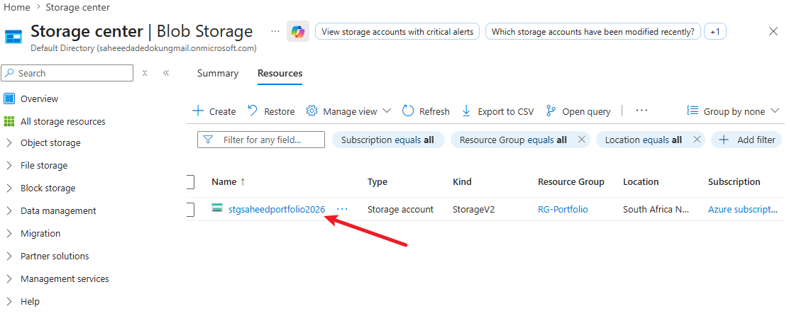
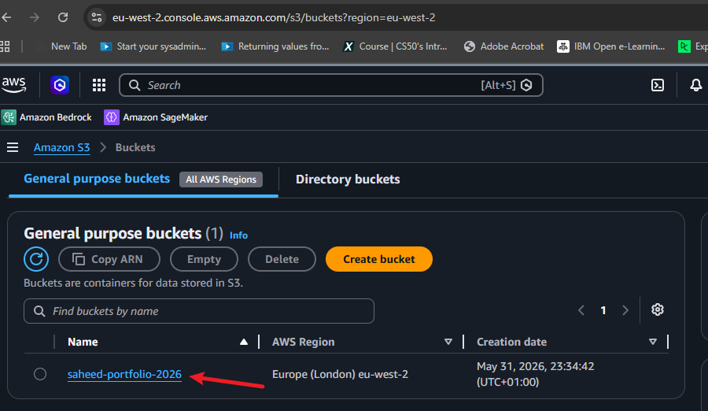
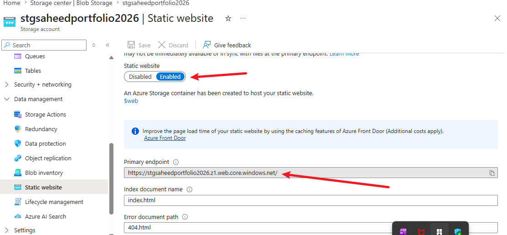
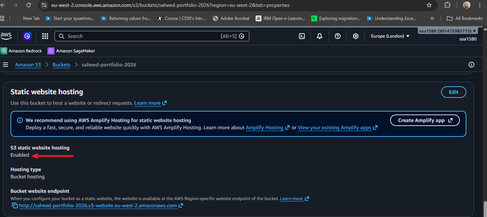
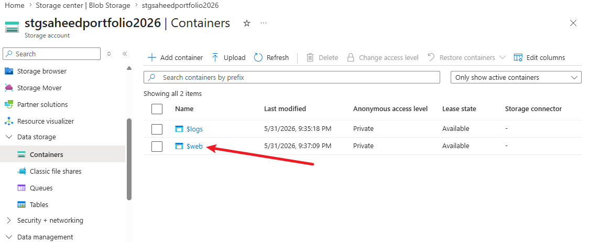
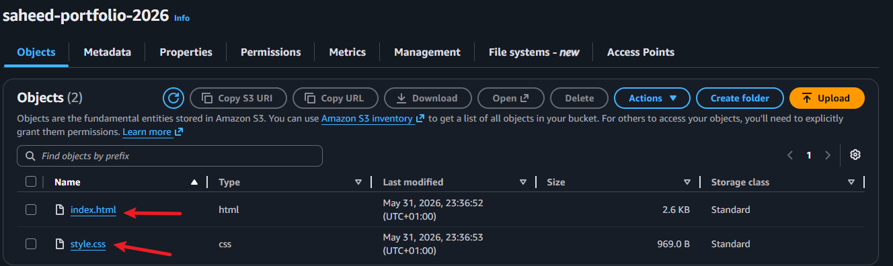
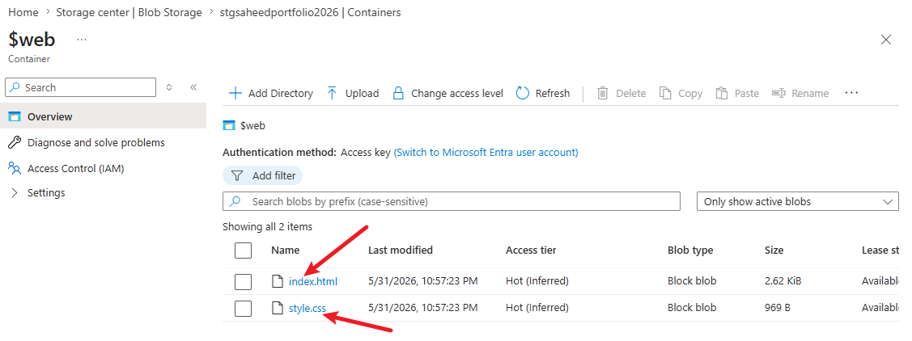
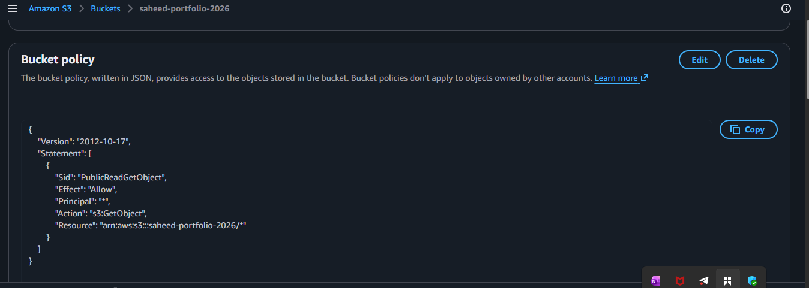
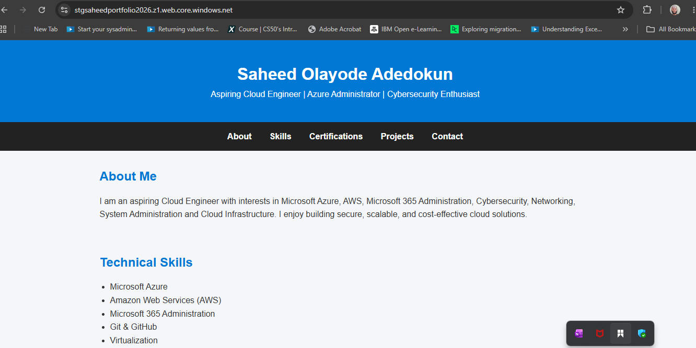
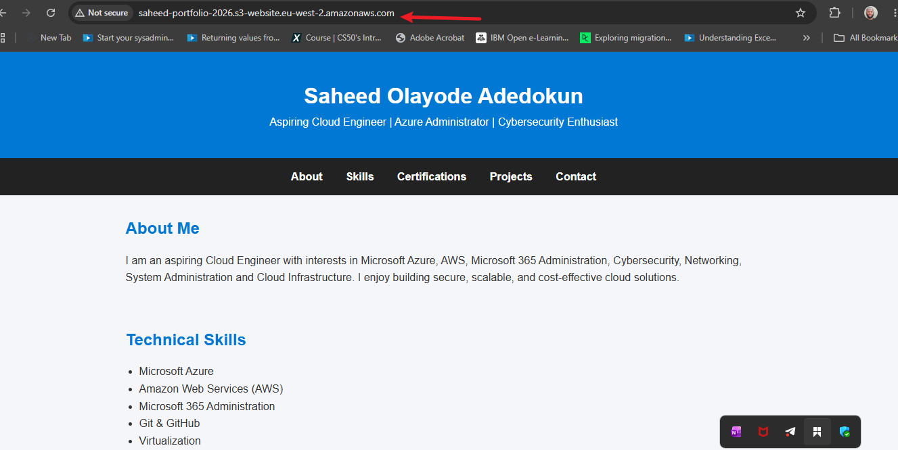

# In this project, I will be showing you how I created and hosted a static portfolio website using AWS S3 and Azure Blob Storage without provisioning.

## 1. I created my static portfolio website using index.html and style.css files. I used HTML and CSS to design the layout and style of my website.

A.     

B. 

## 2. I enabled static website hosting on both Azure Blob Storage and AWS S3.

A. 

B. 

## 3. Azure automatically created a $web container for hosting the static website, while in AWS S3, I created a S3 bucket manually.

A. 

B. 

## 4. Uploaded my index.html and style.css files to both Azure Blob Storage and AWS S3.

A. 

B. 

## 5. Finally, I accessed my static portfolio website using the provided endpoint URLs from both Azure Blob Storage and AWS S3.

A. 

B. 

